# ascii-art-mcp

MCP server for converting images to ASCII art.


> 200 chars wide, `classic` charset (70 tonal levels), hi-fi color — every character is a pixel.

Two modes — **photo** and **logo** — with smart defaults for each.

| | Photo | Logo |
|---|---|---|
| **Processing** | Hi-fi: sharpening, gamma, shadow lifting | Standard contrast |
| **Background** | `░` fill for visibility | Clean spaces |
| **Trimming** | None | Auto-trims whitespace borders |
| **Invert** | Off | Auto-detects light backgrounds |
| **Alpha** | Composites on white | Composites on black |


## Quick Start

Works out of the box as an MCP server — install it, add it to your config, done.

```bash
pip install ascii-art-mcp
```

Add to your Claude Code settings (`~/.claude/settings.json`):

```json
{
  "mcpServers": {
    "ascii-art": {
      "command": "uvx",
      "args": ["ascii-art-mcp"]
    }
  }
}
```

That's it. The server starts automatically when Claude Code launches, advertises its tools (`convert_image`, `list_charsets`), and handles requests over stdio. No API keys, no configuration, no hosting.

Then just ask:

> "Convert this screenshot to ASCII art in logo mode"
> "Turn my profile photo into colored ASCII art"

Works with any MCP-compatible client (Claude Code, Cursor, etc.).

## Tools

### `convert_image`

Convert an image to ASCII art.

| Parameter | Type | Required | Default | Description |
|-----------|------|----------|---------|-------------|
| `image_path` | string | yes | — | Path to image file |
| `mode` | string | yes | — | `"photo"` or `"logo"` |
| `width` | int | no | 80 | Output width (20-200 chars) |
| `charset` | string | no | auto | Character set (run `list_charsets`) |
| `color` | bool | no | false | ANSI 256-color output |
| `invert` | bool | no | auto | Flip brightness mapping |

**Photo mode** — optimized for photographs: hi-fi processing with shadow lifting, sharpening, gamma correction. Fills empty space with `░` for visibility in terminals/chat.

**Logo mode** — optimized for logos, icons, and text: clean spaces (no `░` fill), auto-trims whitespace borders, auto-inverts light backgrounds, alpha-aware compositing against black.

### `list_charsets`

Returns available character sets with descriptions and recommendations.

## Character Sets

Each charset maps pixel brightness to a different set of characters. The number of unique characters determines how much tonal detail you get.

### `detailed` — 10 levels, good all-rounder (default)

`@%#*+=-:. ` — balanced between detail and readability. Works for both photos and logos.

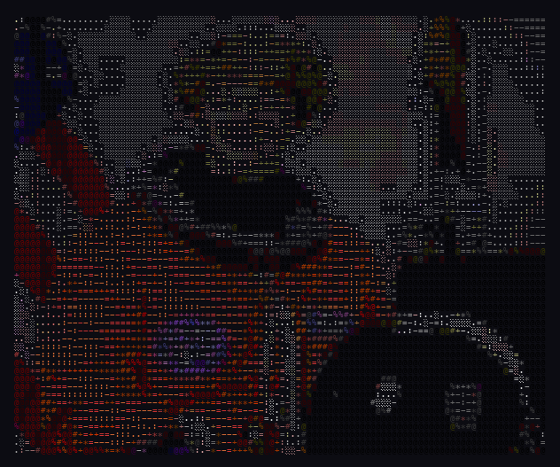

### `classic` — 70 levels, maximum tonal range

`$@B%8&WM#*oahkbdpqwmZO0QLCJUYXzcvunxrjft/\|()1{}[]?-_+~<>i!lI;:,"^'. ` — the most detailed charset. Every subtle gradient gets its own character. Best for photos where you want maximum fidelity.

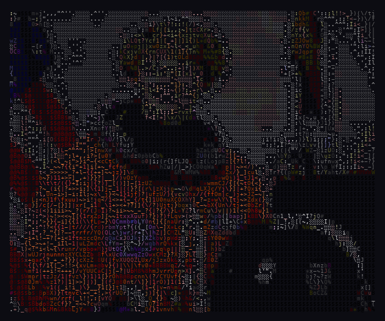

### `simple` — 9 levels, Unicode block shading

`█▉▊▋▌▍▎▏ ` — smooth, print-like appearance using Unicode block elements. Looks like a halftone print.

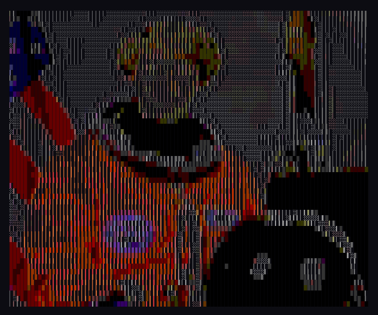

### `blocks` — ~4 levels, coarse block shading

`██▓▒░ ` — bold, high-contrast look. Good for logos and silhouettes where you want punch over detail.

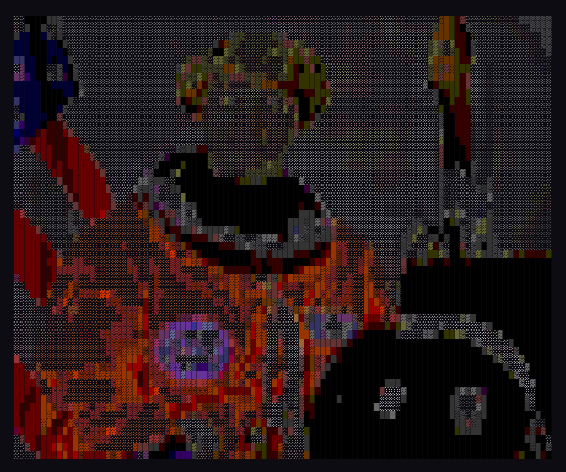

### `minimal` — 3 levels, binary

`■□ ` — just solid, outline, and empty. Crispest edges, no gradients. Best for logos and icons.

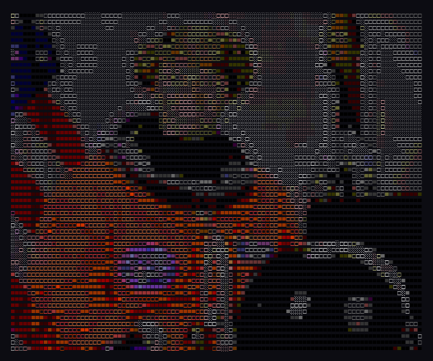

### `hifi` — ~9 levels, fine gradation

Repeated characters (`@@@###***+++===---:::...`) create smooth tonal bands. Good for photos.

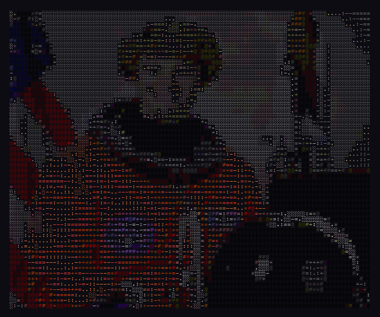

### `dense` — ~4 levels, heavy block shading

Heavy Unicode blocks — bold, poster-like look.

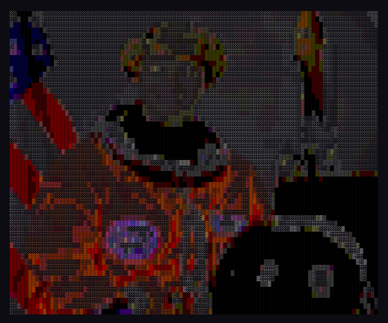

### `ultra` — ~9 levels, balanced ASCII

Repeated ASCII characters (`@@@###***+++===---:::...`) — like `hifi` but pure ASCII, no Unicode.

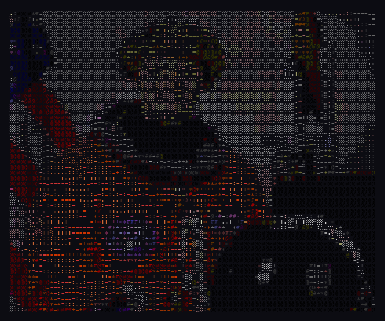

## Choosing a Width

The `width` parameter controls how many characters wide the output is. More characters = more detail, but also more text.

| Width | Best for | Detail |
|-------|----------|--------|
| 40 | Thumbnails, chat messages | Blocky, shape only |
| 80 | Terminal default, Discord | Good balance |
| 120 | Wide terminals | Sharp, features visible |
| 200 | Maximum detail | Near-photographic |

### Width 40
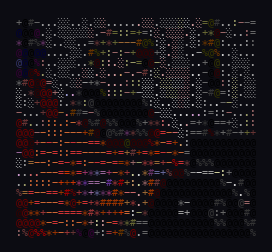

### Width 80 (default)
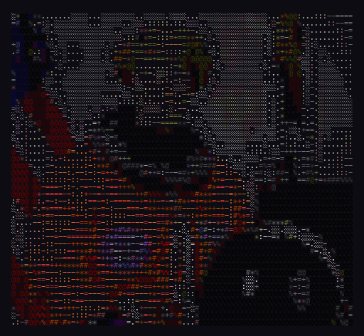

### Width 120
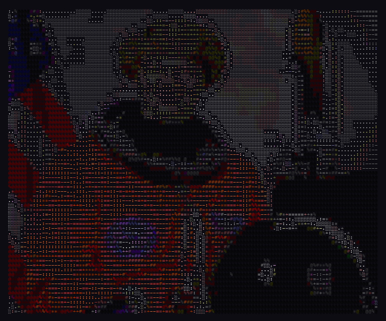

### Width 200
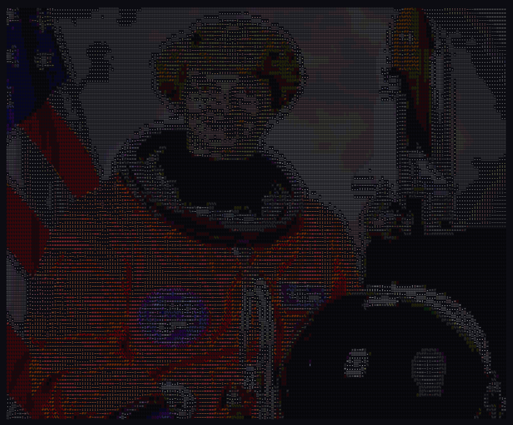

**Rule of thumb:** match `width` to where the output will be displayed. Terminal? Use 80-120. Discord message? Use 40-60. Saving to a file? Go big with 160-200.

## License

MIT
