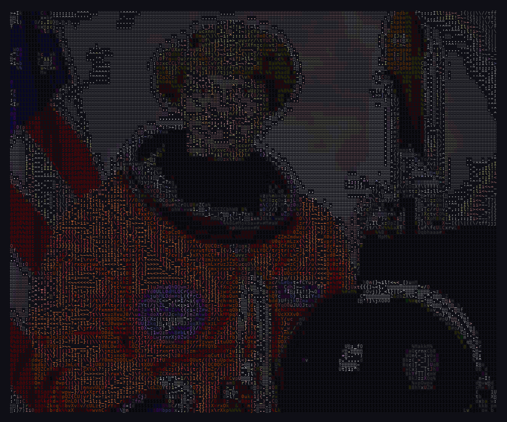
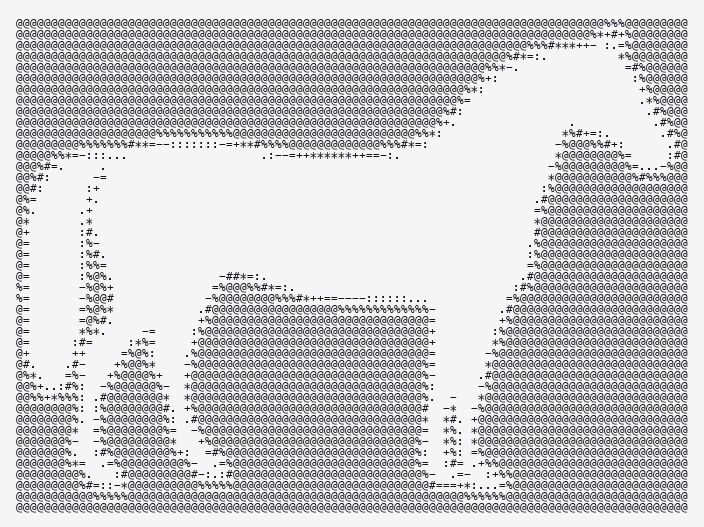

# ascii-art-mcp

MCP server for converting images to ASCII art. Two modes — **photo** and **logo** — with smart defaults for each.

**Photo mode** — hi-fi color, 160 chars wide, `classic` charset (70 tonal levels):



**Logo mode** — clean spaces, auto-trim, auto-invert:



## Install

```bash
# With uvx (recommended)
uvx ascii-art-mcp

# Or pip
pip install ascii-art-mcp
```

For enhanced photo processing (adaptive histogram equalization):

```bash
pip install ascii-art-mcp[hifi]
```

## Usage with Claude Code

Add to your Claude Code settings:

```json
{
  "mcpServers": {
    "ascii-art": {
      "command": "uvx",
      "args": ["ascii-art-mcp"]
    }
  }
}
```

Then ask Claude to convert images:

> "Convert this screenshot to ASCII art in logo mode"
> "Turn my profile photo into colored ASCII art"

## Tools

### `convert_image`

Convert an image to ASCII art.

| Parameter | Type | Required | Default | Description |
|-----------|------|----------|---------|-------------|
| `image_path` | string | yes | — | Path to image file |
| `mode` | string | yes | — | `"photo"` or `"logo"` |
| `width` | int | no | 80 | Output width (20-200 chars) |
| `charset` | string | no | auto | Character set (run `list_charsets`) |
| `color` | bool | no | false | ANSI 256-color output |
| `color_style` | string | no | natural | Palette: natural, vivid, ocean, sunset |
| `invert` | bool | no | auto | Flip brightness mapping |

**Photo mode** — optimized for photographs: hi-fi processing with shadow lifting, sharpening, gamma correction. Fills empty space with `░` for visibility in terminals/chat.

**Logo mode** — optimized for logos, icons, and text: clean spaces (no `░` fill), auto-trims whitespace borders, auto-inverts light backgrounds, alpha-aware compositing against black.

### `list_charsets`

Returns available character sets with descriptions and recommendations.

## Character Sets

| Name | Levels | Best for | Description |
|------|--------|----------|-------------|
| `detailed` | 10 | both | ASCII gradient, good all-rounder |
| `classic` | 70 | photo | Maximum tonal range |
| `simple` | 9 | photo | Unicode block shading |
| `hifi` | ~9 | photo | Repeated chars for fine gradation |
| `minimal` | 3 | logo | Binary black/white, crispest edges |
| `blocks` | ~4 | logo | Coarse block shading |
| `dense` | ~4 | logo | Heavy block shading |
| `ultra` | ~9 | both | Balanced ASCII gradation |

## License

MIT
